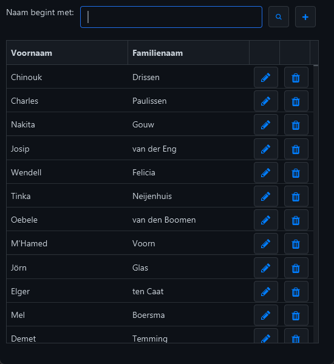
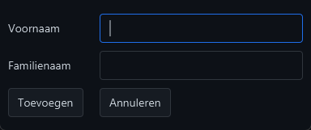
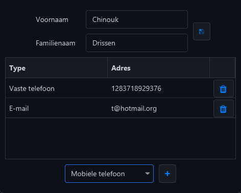

# JavaFX GUI for Contacts Database

This project provides a JavaFX-based GUI for managing a contacts database, as used in the course exercises. It supports searching, adding, editing, and deleting people and their contact information, and integrates with an Apache Derby database.

## Features

### Main Window
- Search by last name prefix using the search bar or Enter key.
- Add a new person via the plus (`+`) button.
- Edit a person's details via the pencil (`✎`) button or by double-clicking a row.
- Delete a person using the trash (`🗑️`) button.

> 
> <p>Main window.</p>

### Add Person Window
- Fill in the first and last name and press "Add" to insert into the database.
- Cancel without modifying data using the "Cancel" button.

> 
> <p>Edit window.</p>

### Edit Contact Window
- Modify first and last name and save changes.
- Inline editing of contact addresses directly in the table.
- Add contact details using a contact type selector and `+` button.
- Delete individual contact entries with a trash button.

> 
> <p>Add window.</p>

## Notes

- The two sub-windows (Add/Edit) are **modal**: the main window is inactive while they are open.
- All buttons include tooltips describing their function.
- The GUI supports **internationalization**: all UI strings are in a resource bundle and not hardcoded.
- Contact types are dynamically retrieved from the database and not hardcoded.
- **To specify the language (English or Dutch), you must provide `en` or `nl` as a command-line argument when launching the application.**

## Setup Instructions

1. Copy the `db.properties.template` from:
   ```
   src/main/resources/properties/
   ```
   Rename it to `db.properties` and configure it for your database setup.

2. To initialize the Apache Derby database used in this example, use:
   ```
   src/main/resources/setup/ddl.sql
   ```

3. For testing the application, example data is provided in:
   ```
   src/main/resources/setup/names.csv
   ```

## Dependencies

- JavaFX
- Apache Derby (Java DB)

## Visual Styling

To enhance the visual appearance of the application, the [Atlantafx PrimerDark theme](https://github.com/mkpaz/atlantafx) was used.

If you wish to remove it:
- Remove the dependency from `pom.xml`
- Delete or comment out the following line in `DatabankGUIApplication`:
  ```java
  Application.setUserAgentStylesheet(new PrimerDark().getUserAgentStylesheet());
  ```